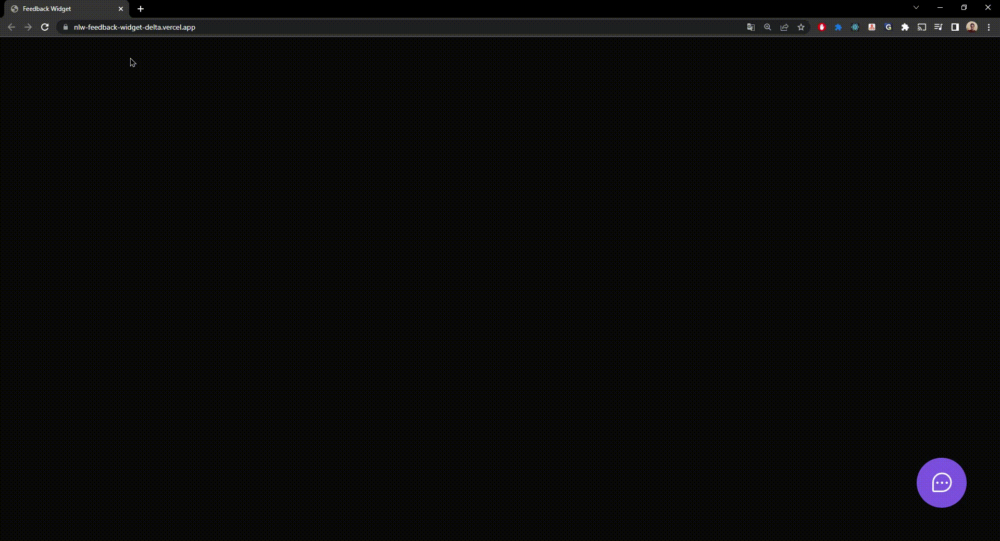

# Feedback Widget

## Project developed during the 'Next Level Week Return' made by Rocketseat

### Demonstration of use

  

### Description

The project consists of a feedback button where the user can report a problem, idea or some other type of feedback,
attach a screenshot (the screenshot is taken automatically when using the camera button), after sending the 
feedback an email is triggered to notify the new feedback record.

## Technologies

### Front-end
- ReactJS
- Typescript
- TailwindCSS
- Headless UI
### Back-end
- NodeJS
- Typescript
- Prisma
- Jest
### Deploy
- Vercel
- Railway

### To use the application go to - https://nlw-feedback-widget-delta.vercel.app/
